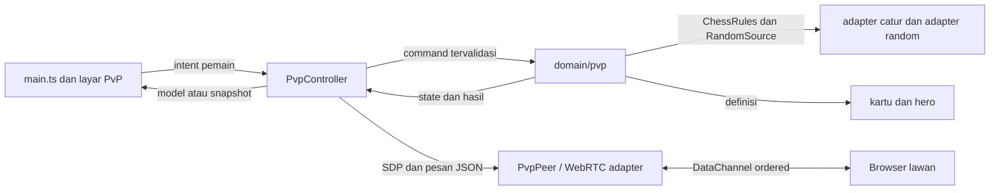

# Struktur Mode Online 1vs1 Saat Ini

Dokumen ini menjelaskan implementasi PvP yang ada di source saat ini. Istilah **online** berarti dua browser terhubung langsung melalui WebRTC. Aplikasi tidak menyediakan server permainan.

## Batas mode

- Dua pemain menjalankan aplikasi di browser atau perangkat masing-masing.
- Pemain memilih hero dan deck, lalu memilih peran: host putih atau tamu hitam.
- Mereka bertukar SDP offer dan answer secara manual melalui salin-tempel.
- WebRTC DataChannel membawa loadout, command, dan snapshot state.
- Campaign tetap single-player dan dapat berjalan offline. Hanya PvP yang memerlukan jaringan.
- Tidak ada akun, identitas pemain, matchmaking, chat, backend pertandingan, layanan signaling, atau relay TURN.
- Koneksi memakai STUN publik `stun:stun.l.google.com:19302`. NAT simetris atau firewall tertentu dapat membuat koneksi langsung gagal.

## Peta modul dan kepemilikan

| Lapisan | File | Tanggung jawab |
|---|---|---|
| Entry point dan composition | `src/main.ts` | Menggabungkan content, adapter catur, random source, controller, state layar, render, dan handler intent. Handler meneruskan aksi ke command atau application. |
| Screen selection dan shell | `src/ui/render.ts` | Memilih layar lobby atau duel dan membungkus lobby dengan navigasi hub. |
| PvP presentation | `src/ui/screens/pvp.ts` | Merender lobby, informasi koneksi, panel pemain, hasil, serta dialog promosi. Tidak menghitung langkah atau biaya. |
| Papan dan kartu bersama | `src/ui/board/board.ts`, `src/ui/cards/cards.ts` | Menampilkan snapshot papan, langkah legal, marker, dan kartu. PvP memberi nama command berbeda agar klik papan/kartu masuk ke controller PvP. |
| Presentation data | `src/main.ts` | Membentuk `PvpLobbyView` dan `PvpDuelView` dari model controller, data content, dan `PvpState`. Menghitung label, disable state, dan marker yang akan dirender. |
| Use case PvP | `src/application/pvp.ts` | `PvpController` mengelola fase lobby/connecting/duel, peran, loadout, protokol pesan, otoritas host, dan broadcast snapshot. Tidak mengakses DOM. |
| Domain PvP | `src/domain/pvp/state.ts`, `src/domain/pvp/commands.ts` | Mendefinisikan state simetris per warna, snapshot, validasi command, aturan resource, kartu, hero, giliran, dan hasil pertandingan. |
| Adapter koneksi | `src/adapters/webrtc.ts` | Membuat `RTCPeerConnection`, STUN, DataChannel, pertukaran SDP, clipboard, status, dan parsing pesan JSON. |
| Adapter aturan catur | `src/adapters/chess-rules.ts` | Menjembatani tipe bidak battle dan engine catur. `src/domain/chess/` menghitung langkah dasar, keselamatan raja, rokade, en passant, dan koordinat. |
| Sumber data bersama | `src/content/cards.ts`, `src/content/heroes.ts` | Menyimpan 37 kartu dan enam hero beserta biaya, rarity/weight, aksi, portrait, serta atributnya. PvP membaca sumber yang sama dengan campaign. |
| Aturan visual | `src/styles/game.css` | Menata lobby dan duel memakai sistem visual aplikasi, termasuk layout responsif dan scroll vertikal untuk layar PvP. |

`src/domain/pvp/index.ts` mengekspor state, tipe, dan command PvP. Domain menerima `PvpDeps` berisi aturan catur, random source, kartu, dan hero. Domain tidak membaca DOM, storage, atau WebRTC.

## Arus data

### State yang dimiliki domain

`PvpState` menyimpan:

- Papan 8×8, giliran warna, hak rokade, status en passant, langkah terakhir, riwayat langkah, jumlah tangkapan, ply, dan nomor giliran.
- State terpisah untuk putih dan hitam di `sides`. Setiap sisi memiliki hero, deck 11 kartu, tangan 3 kartu, mana, EN, jumlah/bonus reroll, dan flag efek yang sedang dipersenjatai.
- Target dan rencana hero per sisi, seperti bidak target untuk pola gerak khusus, langkah pion khusus, atau bidak yang dapat dipulihkan dari graveyard.
- Efek lintas sisi di `effects`: ward, snare, stagger, blockade, mark, dan aegis, termasuk pemilik serta sisa balasan.
- State interaksi: bidak terpilih, target kartu/hero yang aktif, biaya kartu yang sedang dibayar, promosi tertunda, hasil game, dan pesan status.
- Riwayat snapshot `past` dan `anchor` yang dipakai untuk undo.

State kartu, hero, dan aturan catur tidak disalin ke UI. `snapshotPvp()` membuat salinan terpisah untuk transport; snapshot tidak membawa `past`, `anchor`, atau `dealtSlot`. Karena itu host menyimpan riwayat undo otoritatif, sedangkan tamu menerima `canUndo` sebagai flag UI bersama snapshot.

### Persiapan pertandingan

1. Lobby mengambil hero aktif dan deck campaign dari state aplikasi.
2. Pemain dapat berpindah ke tab deck di layar Hero sebelum memulai koneksi.
3. `PvpController.validLoadout()` memastikan hero dikenal dan deck lengkap: 10 kartu non-Joker serta 1 Joker tanpa ID asing atau duplikat.
4. Saat host menerima loadout tamu, host membuat papan awal melalui `chessRulesAdapter.initialBoard()` dan membentuk state pertandingan.
5. Kedua sisi mulai dengan mana 0, tiga kartu unik dari deck masing-masing, EN awal sesuai data hero, dan putih mendapat giliran pertama.
6. Random source produksi dibuat oleh `MathRandom` di `main.ts`. Host yang membagikan tangan awal dan menjalankan reroll, lalu mengirim hasilnya sebagai snapshot.

State pertandingan PvP disimpan dalam memori `PvpController`, bukan di localStorage. Pilihan hero/deck mengikuti penyimpanan campaign yang sudah ada, tetapi reload halaman tidak melanjutkan sesi PvP atau koneksi WebRTC.

## Koneksi dan protokol

### Negosiasi SDP

1. Host memilih **Putih: buat tawaran**. `PvpPeer.host()` membuat peer connection dengan STUN, membuka DataChannel ordered, lalu membuat SDP offer.
2. Adapter menunggu `iceGatheringState` menjadi `complete` sebelum menampilkan offer. Kandidat ICE sudah berada di SDP, jadi pemain tidak menukar kandidat secara terpisah.
3. Tamu memilih **Hitam: gabung**, menempel offer, lalu menerapkannya. Tamu memasang remote description, membuat answer, menunggu ICE selesai, dan menampilkan answer.
4. Host menempel answer dan menerapkannya. Saat DataChannel terbuka, host mengirim pesan `hello` berisi hero dan deck.
5. Tamu memvalidasi loadout host, membalas `hello-ack` dengan loadout sendiri. Host memvalidasi balasan, membuat state awal, lalu mengirim snapshot pertama.
6. Tamu masuk ke layar duel setelah menerima snapshot.

Adapter menormalkan line ending SDP saat menerima teks karena textarea atau clipboard dapat mengubah CRLF. Clipboard API menyalin kode jika tersedia; jika tidak, UI memberi instruksi salin manual.

### Pesan DataChannel

Semua pesan dikirim sebagai JSON. Host membuka channel bernama `crown-catalyst-pvp` dengan urutan pesan aktif.

| Pesan | Pengirim → penerima | Isi dan kegunaan |
|---|---|---|
| `hello` | Host → tamu | `heroId`, `deck`; memulai pertukaran loadout. |
| `hello-ack` | Tamu → host | `heroId`, `deck`; setelah valid, host membentuk pertandingan. |
| `command` | Tamu → host | `name`, `args`; intent giliran hitam. Host memvalidasi giliran dan argumen, kemudian menjalankan domain. |
| `state` | Host → tamu | `snapshot`, `canUndo`; memperbarui mirror state tamu setelah perubahan. |
| `bye` | Pemain yang keluar → lawan | Memberi tahu lawan bahwa sesi ditinggalkan. |

Nama command PvP yang diterima controller: `square`, `card`, `hero-skill`, `hero-ultimate`, `reroll`, `cancel-target`, `promotion`, `undo`, dan `restart`. Klik putih diproses host langsung. Klik hitam dikirim sebagai intent; tamu tidak menjalankan hasil command secara otoritatif. Host memeriksa bahwa giliran memang hitam dan domain memeriksa legalitas langkah, resource, target, promosi, dan efek. Setelah command diproses, host memperbarui UI lokal dan mengirim snapshot baru.

### Peran dan batas kepercayaan

- Host selalu putih dan menjadi sumber kebenaran state, undian kartu, hasil command, undo, serta restart.
- Tamu selalu hitam. UI tamu menampilkan mirror snapshot dari host dan mengirim intent ketika giliran hitam.
- Pemain tidak memiliki akun atau identitas yang diverifikasi aplikasi. Host-authoritative membatasi perbedaan state, tetapi bukan sistem anti-cheat terhadap browser yang dimodifikasi.
- STUN membantu koneksi langsung, bukan relay media/data. Tanpa TURN, sebagian jaringan tidak dapat tersambung.

## Aturan pertandingan

### Catur dan efek

`legalMoves()` meminta langkah dasar dari `ChessRules`, lalu menerapkan filter efek PvP. Langkah biasa tetap menjaga keselamatan raja. Rokade, en passant, dan promosi tersedia untuk kedua warna. Pion yang mencapai baris terakhir membuka pilihan ratu, benteng, gajah, atau kuda bagi pemain yang sedang bergerak.

Efek kartu dan hero yang mengubah papan melewati pemeriksaan legalitas serta keselamatan raja. Engine melarang penangkapan raja; hasil akhir ditentukan oleh tidak adanya langkah legal saat raja diskak (skakmat) atau saat raja tidak diskak (remis/stalemate).

### Mana, EN, kartu, dan reroll

| Aturan | Perilaku di PvP |
|---|---|
| Mana | Milik tiap warna, mulai 0, maksimum 6. Langkah catur yang selesai memberi 1 mana kepada pemain yang bergerak. |
| EN | Milik tiap warna, maksimum 5. Nilai awal mengikuti `startEnergy` hero. |
| Kartu | Dibayar dengan mana. Biaya final membaca kartu dan surcharge/discount hero atau efek yang aktif. Satu kartu berbiaya 0 mana dapat dipakai per giliran. |
| Skill hero | Biaya dasar 2 EN; surcharge skill yang sedang aktif ikut dihitung. |
| Ultimate hero | Biaya 5 EN. |
| Tangan | Tiga kartu unik per pemain, diambil dari deck pemain itu sendiri. Weight kartu berasal dari content; Joker memiliki weight 0,2. |
| Reroll | Reroll pertama per giliran gratis; reroll berikutnya memakai 1 EN. Batas standar dua kali dan efek tertentu dapat memberi bonus. |
| Undo | Memulihkan snapshot command/gerak terakhir yang tercatat, termasuk state papan dan resource. Bukan undo seluruh satu putaran putih-hitam sekaligus. Setelah hasil akhir, pemain masih dapat memakai undo yang tersedia untuk kembali bermain. |
| Restart | Membuat state papan dan tangan baru sambil mempertahankan hero dan deck kedua pemain. |

Detail biaya dan perilaku kartu tetap berada di `src/content/cards.ts` serta resolver di `src/domain/pvp/commands.ts`. Implementasi mencakup 37 kartu untuk kedua perspektif; kartu target membayar mana saat diaktifkan, lalu membatalkannya mengembalikan mana. Target skill/ultimate hero dapat dibatalkan sebelum konfirmasi tanpa memakai EN.

Aksi hero berasal dari `skillAction` dan `ultimateAction` pada content, lalu resolver memakai warna aktif. Pemetaan aksi saat ini:

| Hero | Skill | Ultimate |
|---|---|---|
| Arunika | `phase` | `fold` |
| Bara | `focus` | `smite` |
| Nila | `ward` | `aegis` |
| Saka | `pawnstep` | `pawnrush` |
| Veyra | `snare` | `skip` |
| Liora | `blockade` | `citadel` |

## UI 1vs1

### Lobby

Lobby dibuka melalui navigasi hub **1vs1**. Isinya:

- Pilihan hero dengan portrait serta ringkasan deck lokal. Hero dapat diubah sebelum peran koneksi dipilih.
- Tombol **Atur deck** yang menuju deck builder pada layar Hero.
- Tombol host putih dan gabung hitam. Tombol tidak aktif sampai loadout lengkap.
- Panel kode lokal yang read-only untuk offer/answer dan tombol salin.
- Textarea kode lawan, tombol terapkan, status koneksi, pesan error, dan instruksi pertukaran kode.
- Status dan error memakai region teks yang diumumkan screen reader. Hero, deck, dan warna dikunci setelah sesi dimulai.

Urutan salin-tempel terlihat di teks lobby: putih mengirim offer ke hitam, hitam mengirim answer ke putih, lalu putih menerapkan answer. Kedua halaman harus tetap terbuka selama duel.

### Layar duel

`renderPvpDuel()` menyusun layar duel dari `PvpDuelView`:

- Header: nomor giliran, undo, restart, suara, dan tinggalkan sesi.
- Status koneksi, status giliran, pesan papan, dan hasil menang/kalah/remis.
- Papan catur 8×8 dengan langkah legal, petak terpilih, langkah terakhir, tanda skak, serta marker efek seperti ward, snare, stagger, mark, blockade, dan aegis.
- Panel pemain sendiri: warna, hero/portrait, EN, mana, aksi skill/ultimate beserta biaya, dan state target.
- Panel lawan: hero, EN, mana, aksi hero beserta biayanya, serta nama/efek tangan lawan. Kartu lawan ditampilkan sebagai informasi, bukan tombol yang dapat dimainkan.
- Rail tiga kartu pemain sendiri dengan biaya, affordability, state aktif/terkunci, dan tombol reroll.
- Dialog promosi hanya untuk pemain yang memindahkan pion. Pemain lain menunggu snapshot pilihan promosi.
- Tombol batal target tersedia pada papan. Escape membatalkan target aktif; Escape tidak membuang dialog promosi yang masih menunggu pilihan.

Renderer memakai komponen papan dan kartu yang sudah ada. `main.ts` menerjemahkan event tombol dan petak menjadi command controller, lalu merender model terbaru. Komponen UI tidak menentukan legalitas langkah atau membayar resource.

### Layout, aksesibilitas, dan lifecycle

- Di bawah 660px, lobby dan duel memakai satu kolom. Papan tampil sebelum panel sendiri, rail kartu, dan panel lawan.
- Mulai 660px, lobby memakai dua kolom dengan panel SDP selebar layout; duel menampilkan papan selebar layout, panel kedua pemain berdampingan, lalu rail kartu tiga kolom.
- Mulai 1160px, panel lawan, papan, dan panel sendiri berada berdampingan; rail kartu membentang di bawahnya.
- Konten duel melebihi tinggi viewport saat papan dan kartu tampil bersamaan. Halaman PvP mengizinkan scroll vertikal agar panel dan tombol tidak saling menutup.
- Papan memiliki label grid, tombol memakai label dan state disabled, status memakai `aria-live`, error memakai `role="alert"`, dan promosi memakai dialog modal berlabel.
- Saat keluar, controller mengirim `bye`, menutup peer connection, mengosongkan state PvP lokal, lalu kembali ke menu. Lawan kembali ke lobby dengan status bahwa sesi ditinggalkan.

## Pemeriksaan pengembang

- `npm run pvp` menjalankan smoke test domain PvP tanpa DOM atau transport, termasuk state dua warna, semua kartu, aturan catur, resource, target, promosi, undo, restart, dan hasil pertandingan.
- `npm run verify:pvp-browser` menjalankan walkthrough WebRTC dua browser terhadap preview lokal.
- `npm run verify` menjalankan typecheck, smoke test domain, pemeriksaan parity dan render, build, serta pemeriksaan hasil build.
- `npm run verify:browser` juga menjalankan pemeriksaan campaign/responsif sebelum walkthrough PvP. Jika pemeriksaan layout campaign menghentikan rangkaian, jalankan `verify:pvp-browser` secara terpisah untuk memeriksa mode 1vs1.
